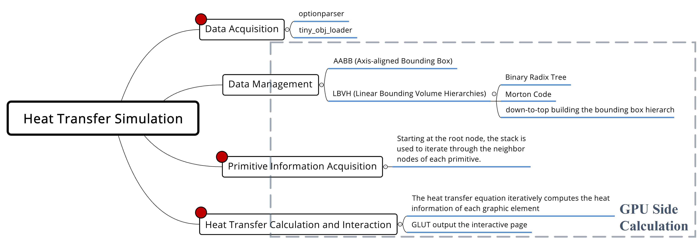
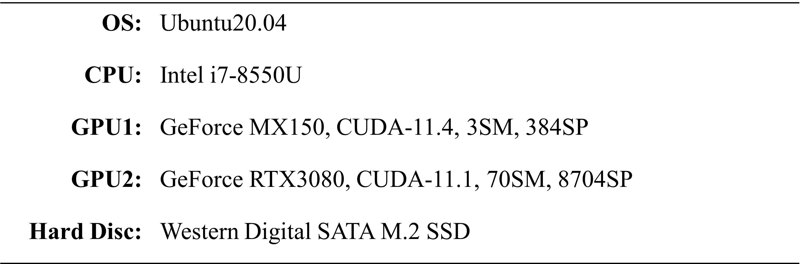
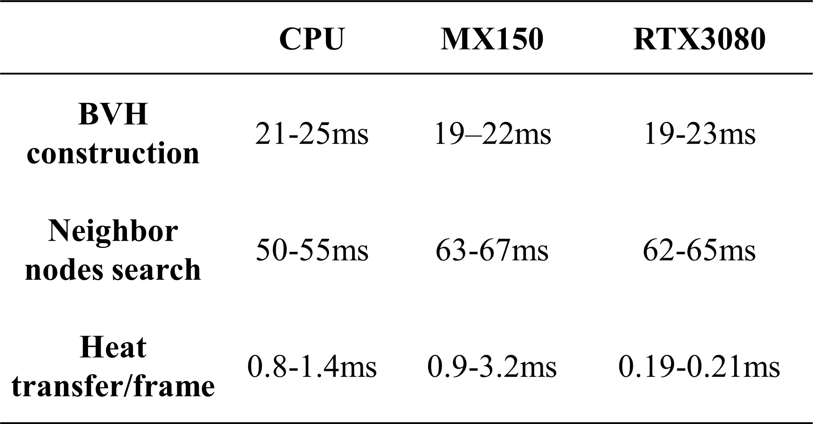
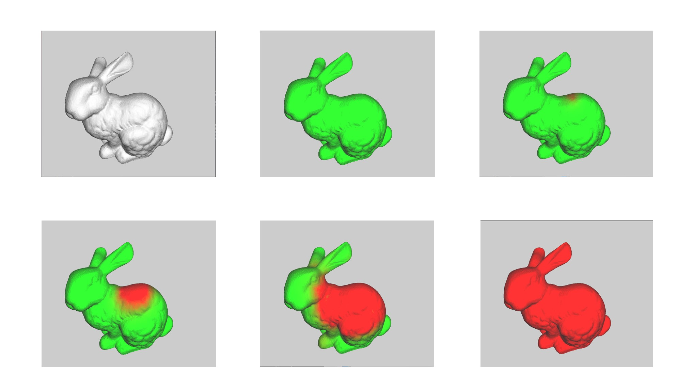

# Heat Transfer in 3D Space

## Parallel accelerated requirements analysis

<div align=center></div>

## Heat Transfer Format

$$
\begin{array}{l} T _ { c u r r } ^ { i } = k T _ { p r e v } ^ { i } + ( t _ { v } \sum ( T _ { p r e v } ^ { j } - T _ { n b } ^ { j } ) + l T _ { p r e v } ^ { i } ) / ( N u m _ { n b } + 1 )  \end{array}
$$

The superscript $i$ and $j$ denote the position of the element of the three-dimensional model, $k \in[0,1]$ denotes the heat information of the current element which is not dissipated in each iteration, and the subscript $curr$ and $prev$ distinguish the current heat information from the previous heat information, $t_v$ denotes the heat conduction rate, $l \in[0,1]$ is the heat loss coefficient, $Num_{nb}$ denotes the number of neighbor nodes.

## Environment

<div align=center></div>

## Result

<div align=center> </div>

## Configure

Only if you have CUDA 8 or newer, when you are enabled to use extended lambada feature. [New Compiler Features in CUDA 8](https://developer.nvidia.com/blog/new-compiler-features-cuda-8/)

## Problem Record

### 1. How to use lambda in CUDA?

When I use `--expt-extended-lambda` option, linker seems to be abnormal.

```shell
/usr/bin/ld: cannot find -lcudadevrt
/usr/bin/ld: cannot find -lcudart_static
```

["/usr/bin/ld: cannot find -lcudart"](https://askubuntu.com/questions/510176/usr-bin-ld-cannot-find-lcudart) in `ask ubuntu` forum successfully solved this problem.

```shell
sudo ln -s /usr/local/cuda/lib64/libcudart_static.a /usr/lib/libcudart_static.a
sudo ln -s /usr/local/cuda/lib64/libcudart_static.a /usr/lib/libcudadevrt.a
```

### 2. illegal reference in `Kernel`

```c++
__global__ void 
computeBBoxes_kernel(const std::uint32_t &num_objects, triangle_t* trianglePtr, vec3f* verticePtr, AABB* aabbPtr);
```

I use `&` to determine a referenced value in kernel parameters. However, it is illegal. It will rise the following error report. [[see details here](https://www.coder.work/article/2793171)]

```shell
terminate called after throwing an instance of 'thrust::system::system_error'
  what():  after reduction step 1: cudaErrorIllegalAddress: an illegal memory access was encountered
Aborted (core dumped)
```

### 3. thrust::reduce

I thought the following code only stored the sum result of each `vecIn`'s element in `result`. But it also changed the `vecIn`. If your data in `vecIn` are `[1, 3, 5, 6]`, the result will be `[1, 4, 9, 15]`. **If you really want to use `thrust` library, please do test first!**.

```c++
int result = thrust::reduce(vecIn.begin(), vecIn.end(), thrust::plus<int>(), 0);
```

### 4. size_t

You can call `.size()` method in STL or thrust `vector` template class. Its returned type `size_t` may not correspond to what you want. Please transform the type to avoid unexpected behaviors.

### 5. raw pointer

If you have a `thrust::device_vector` variable `a`, `a.data()` will return `thrust::device_ptr` type, and `a.data().get()` will return the raw pointer type, stored in GPU memory.

# Reference

> [1] [Thinking Parallel, Part I: Collision Detection on the GPU](https://developer.nvidia.com/blog/thinking-parallel-part-i-collision-detection-gpu/)\
> [2] [Thinking Parallel, Part II: Tree Traversal on the GPU](https://developer.nvidia.com/blog/thinking-parallel-part-ii-tree-traversal-gpu/)\
> [3] [Thinking Parallel, Part III: Tree Construction on the GPU](https://developer.nvidia.com/blog/thinking-parallel-part-iii-tree-construction-gpu/)\
> [Resource] [Maximizing Parallelism in the Construction of BVHs, Octrees, and k-d Trees](https://research.nvidia.com/publication/2012-06_maximizing-parallelism-construction-bvhs-octrees-and-k-d-trees)\
> [Resource] [tinyobjloader-v1.0.6](https://github.com/tinyobjloader/tinyobjloader/tree/v1.0.6)\
> [Resource] [simple obj-viewer](https://github.com/justint/obj-viewer)
